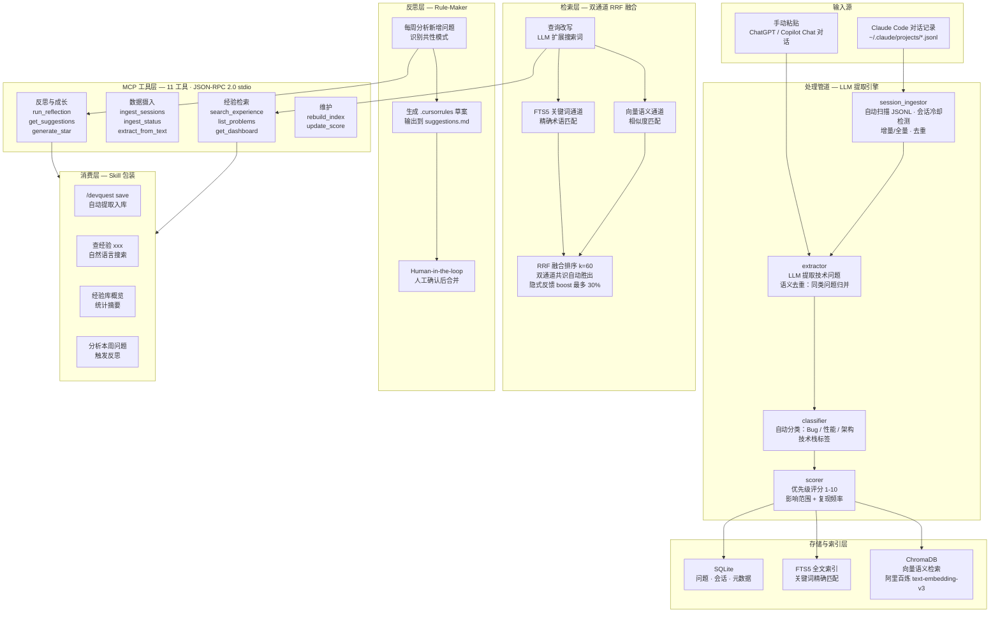

# DevQuest

**开发者的"外脑" — 从 AI 编程对话中自动沉淀经验，需要时精准找回。**

DevQuest 是一个 MCP-native 的开发者知识管理工具。它不只是一个"存数据然后搜"的 CRUD 应用——它试图回答一个问题：**AI 编程时代，开发者的经验到底应该存放在哪里？**

---

## 为什么做这个

每天和 Claude Code 结对编程，花一小时排查的 Docker 配置问题解决了，换个 session 就消失在对话历史里。下次遇到"上次那个容器启动报错怎么修的"，只能从头来过。

这些对话不是没价值——是**没有被留存**。AI 编程工具的对话是"按时间衰减的记忆"：对话结束，经验清零。我需要的不是一个更好的笔记软件，是一个能融入工作流、无感运行、用的时候自然出现的东西。

---

## 三个产品设计原则

### 知识不依赖记忆

你不需要记得"2026年4月15号下午那场对话"。你只需要记得碎片——"docker 容器启动报错"、"端口被占用怎么查"——双通道 RRF 混合检索（向量语义 + FTS5 关键词 + 查询改写）就能定位到当时的上下文和解决方案。

### 知识会生长

同一个 bug 在不同 session 中反复出现时，DevQuest 不是再建一条新记录——它自动归并到已有条目：attempts 次数 +1、solution 更新为最新方案、tech_stack 合并补充。经验不是静态快照，而是活的。

### 知识会反馈

高频使用的经验在搜索排序中获得隐式 boost（最多 30% 额外权重），越有用的经验越容易被找到。同时 Rule-Maker 反思引擎每周分析问题模式，自动生成开发规则草案——但**不直接覆写** `.cursorrules`，而是输出到 `suggestions.md` 等待人工确认。一条坏规则持续污染所有后续对话的风险，不值得冒。

---

## 项目故事：痛点 → 决策 → 结果

### 痛点

每个开发者都用 AI 编程工具，但每次对话结束经验就丢了。现有的解决方案是手动笔记（靠自律，一定会忘）或者 AI 工具的搜索（搜不到跨 session 的内容）。

### 关键决策

| # | 决策                                     | 为什么                                                                                                                                         |
| - | ---------------------------------------- | ---------------------------------------------------------------------------------------------------------------------------------------------- |
| 1 | **MCP 协议**，不用 REST API        | REST 每个服务 endpoint 命名和参数格式各不相同。MCP 统一了 tool discovery——Client 启动时自动发现所有工具。就像 USB-C 统一了接口               |
| 2 | **双通道 + RRF 融合**，不用纯向量  | 向量适合语义（"容器启动不了"），关键词适合精确匹配（"Dockerfile CMD"）。两路分数量纲不同不能直接加权——RRF 比的是排名，两路共识的文档自动胜出 |
| 3 | **ChromaDB 嵌入式**，不用 Pinecone | 个人工具不需要分布式集群。零运维，数据就在本地——和 SQLite 一样的哲学                                                                         |
| 4 | **Human-in-the-loop 规则注入**     | LLM 反思结果只写到 `suggestions.md`，用户手动确认后才合并到 `.cursorrules`                                                                 |
| 5 | **语义去重**，不建重复记录         | 同类问题再次遇到时自动归并：attempts 累积、solution 迭代、技术栈补充                                                                           |

### 结果

| 指标           | 数值                          |
| -------------- | ----------------------------- |
| 可检索历史会话 | 36 个 JSONL 文件（跨度 3 周） |
| 已沉淀技术问题 | 80 条                         |
| 提取引擎召回率 | 83%                           |
| 提取引擎精确率 | 78%                           |
| 类型分类准确率 | 85%                           |
| MCP 工具数     | 11 个                         |

---

## 技术复用：DevQuest → LineMind

DevQuest 是 MCP + ChromaDB + LangChain 技术栈的**实验田**。在这上面验证了工具设计、检索方案和协议集成后，这些经验直接复用到业务场景项目——[LineMind](../LineMind/linemind/)（企业工单智能分析 Agent 系统）：

| 复用内容 | DevQuest（实验田） | LineMind（业务应用） |
|----------|---------------------|--------------------------|
| MCP Server 标准化 | 11 个工具，JSON-RPC 2.0 stdio | 12 个工具，同一套模式 |
| ChromaDB + Embedding | 向量语义检索通道（阿里百炼） | RAG `search_solutions`，同方案 |
| 混合检索 | 语义 + FTS5 关键词双通道 RRF 融合 | 同架构思路，向量 + SQL 结构化联合查询 |
| LangChain 工具模式 | `@tool` 装饰器 + `bind_tools()` | 相同的工具定义和绑定模式 |
| 工具描述设计经验 | 总结出 description 怎么写 LLM 才选得准 | 12 个工具全部遵循同一设计规范 |

---

## 架构



---

## Skill 包装：从工具到产品

MCP 定义了 11 个工具，但普通用户记不住 tool name 和参数。Skill 是融入工作流的**最后一公里**——把工具调用包装成自然语言和斜杠命令。

安装 Skill 后，在 Claude Code 里无需记忆任何 tool name：

| 你说 / 你输入                | 实际效果                   |
| ---------------------------- | -------------------------- |
| `/devquest save`           | 自动从当前对话提取问题入库 |
| `/devquest 记`             | 同上（中文习惯）           |
| "查经验 docker 容器启动报错" | 双通道 RRF 检索历史方案    |
| "经验库概览"                 | 查看统计摘要               |
| "分析本周问题"               | 触发 Rule-Maker 反思       |

这是一条完整的产品链路：后台跑 MCP Server → 前端是 Claude Code 对话框 → 用户不需要学新界面。

---

## 快速开始

### 环境要求

- Python 3.10+
- DeepSeek API Key（LLM）
- 阿里百炼 API Key（Embedding）

### 一键安装（Windows）

```powershell
.\install.ps1
```

自动完成：pip 依赖 → MCP Server 注册 → Skill 安装 → 权限配置。然后在 `.env` 里填 API Key，重启 Claude Code。

### 手动安装（macOS/Linux）

1. `pip install -r requirements.txt`
2. 创建 `.env` 填入 API Key（参考 `.env.example`）
3. 在 `~/.claude.json` 注册 MCP Server
4. `mkdir -p ~/.claude/skills/devquest && cp skill/SKILL.md ~/.claude/skills/devquest/SKILL.md`
5. 重启 Claude Code

### 首次摄入

在 Claude Code 中输入：

> 扫描我的历史会话，把所有技术问题导入经验库

DevQuest 会自动扫描 `~/.claude/projects/` 下的 JSONL 对话记录，提取技术问题并入库。

---

## MCP 工具

### 经验检索

| Tool                  | 说明                                            |
| --------------------- | ----------------------------------------------- |
| `search_experience` | 查询改写 + 双通道 RRF 混合检索 + 隐式反馈 boost |
| `list_problems`     | 按项目/技术栈/评分/类型组合筛选                 |
| `get_dashboard`     | 统计摘要（类型分布、技术栈排名、评分分布）      |

### 数据摄入

| Tool                  | 说明                                                     |
| --------------------- | -------------------------------------------------------- |
| `ingest_sessions`   | 从 Claude JSONL 自动摄入，支持增量/全量                  |
| `ingest_status`     | 查看摄入状态（已处理会话/累计问题/待处理）               |
| `extract_from_text` | 手动粘贴对话文本（支持 ChatGPT/Copilot Chat 等外部对话） |

### 反思与成长

| Tool                | 说明                                             |
| ------------------- | ------------------------------------------------ |
| `run_reflection`  | Rule-Maker：LLM 分析本周问题 → 提炼开发规则草案 |
| `get_suggestions` | 查看规则草案（人工确认后合并，不直接覆写）       |
| `generate_star`   | 为指定问题生成面试 STAR 故事                     |

### 维护

| Tool              | 说明                            |
| ----------------- | ------------------------------- |
| `rebuild_index` | 全量重建 ChromaDB + FTS5 双索引 |
| `update_score`  | 手动调整优先级评分 (1-10)       |

---

## 项目结构

```
devquest/
├── backend/
│   ├── mcp_server.py         # MCP Server 入口（11 tools）
│   ├── extractor.py          # 问题提取引擎 + 语义去重
│   ├── classifier.py         # 技术标签自动分类
│   ├── scorer.py             # 优先级评分
│   ├── vector_search.py      # 双通道检索 + 查询改写 + 反馈闭环
│   ├── star_gen.py           # STAR 故事生成
│   ├── session_ingestor.py   # Claude JSONL 自动摄入
│   ├── rule_maker.py         # Rule-Maker 反思引擎
│   ├── models.py / database.py
├── scripts/
│   ├── eval_extractor.py     # 提取引擎评测
│   └── smoke_test.py         # 冒烟测试
├── sample_conversations/     # 评测用对话样本 (4 组)
├── skill/
│   └── SKILL.md              # Claude Code Skill
├── data/                     # SQLite + ChromaDB 持久化
├── AGENTS.md                 # AI 开发规范
└── CHANGELOG.md              # 版本记录
```

## 评测

提取引擎在 4 个真实 Claude Code 对话样本（13 个人工标注预期问题）上的表现：

| 指标           | 数值                                             |
| -------------- | ------------------------------------------------ |
| 平均召回率     | 83%                                              |
| 平均精确率     | 78%                                              |
| 平均类型准确率 | 85%                                              |
| 最强单样本     | 召回率 100% / 精确率 100%（api_migration_issue） |

### 评测方法

1. 从实际 Claude Code 对话中选取 4 组不同场景的 JSONL 文件（Web 应用调试 / React 渲染性能 / REST→GraphQL 迁移 / CI/CD 流水线优化）
2. 人工标注每段对话中应被提取的技术问题（共 13 个），记录预期类型、技术栈
3. 提取引擎处理每个样本，对比输出与标注，计算精确率、召回率、类型准确率
4. 评测脚本自动化：`python scripts/eval_extractor.py`，可重复执行

### 当前局限

- 评测样本仅 4 组（13 个问题），覆盖场景有限——**这是提取引擎评测的已知边界**，样本集正在持续扩充
- 目前所有经验来自单人使用（作者本人），多用户场景下的提取质量未经测试
- 评测针对提取引擎，端到端检索效果（用户搜索满意度）尚未量化

> 运行评测：`python scripts/eval_extractor.py`

Python 3.10+ · MCP SDK · LangChain · DeepSeek · 阿里百炼 Embedding · ChromaDB · SQLite FTS5 · SQLAlchemy

## 许可

MIT
